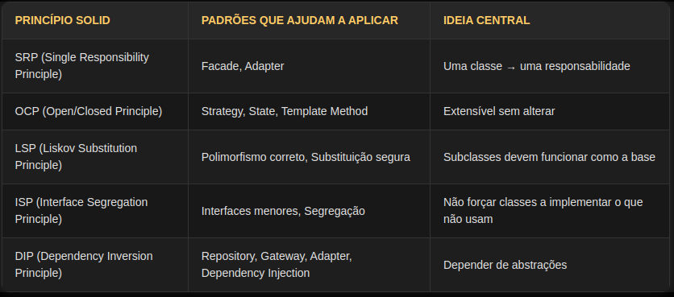

# solid

- É um conjunto de **5 princípios** de orientação a objetos.
	- Um princípio é uma regra ou orientação fundamental que serve de base para tomar decisões e orientar comportamentos ou práticas em determinada área, como programação.
	- Orientação é o ato de direcionar, guiar ou indicar um caminho, regra ou conduta a ser seguida para atingir determinado objetivo ou realizar uma atividade de forma correta.

1. SRP: Single Responsibility Principle
	- Uma classe deve ter uma única responsabilidade → um único motivo para mudar.
2. OCP: Open-Closed Principle
	- Uma classe deve estar aberta para extensão e fechada para modificação.
	- podemos adicionar novos comportamentos sem alterar o código existente.
3. LSP: Liskov Substitution Principle
	- Subclasses devem poder substituir a classe pai sem quebrar o programa.
4. ISP: Interface Segregation Principle
	- Uma classe não deve ser forçada a implementar métodos que não utiliza.
5. DIP: Dependency Inversion Principle
	- dependa de abstrações e não de implementações
	- reduzir o acoplamento
	- inverter o controle
	- container de injeção de dependencia, fica responsavel por criar  os objetos e passa as dependencias para o construtor, pra fazer essa inversão de controle

- Objetivo:
	- melhorar a forma como codificamos, tornando o software mais fácil de entender, manter e evoluir.
		- Em programação, "codificar" significa escrever códigos (instruções) em uma linguagem de programação para criar softwares, resolver problemas ou automatizar tarefas.
	- arquitetura de software tem varios pilares, a forma e como eu codifico é um deles
	- programação orientada a objetos é uma forma de programar
	- a varias boas praticas para orientação a objetos e uma delas é o SOLID